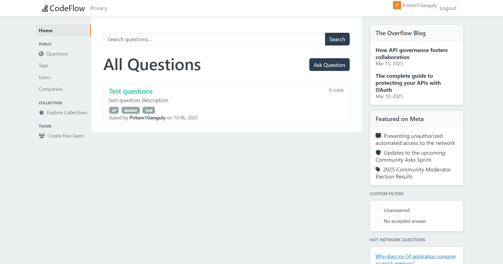

CodeFlow - A stack overflow clone. 

docker exec -it codeflow_db psql -U codeflow_user -d codeflow

# Roadmap

### Core Feature Enhancements
- ✅ **Voting System Completion**
  - ✅ Extend voting to answers
  - ✅ Implement vote scoring logic for answers
  - ✅ Add visual feedback for voted posts
  - ✅ Prevent self-voting

- ✅ **Answer Acceptance**
  - ✅ Add "Accept Answer" functionality for question owners
  - ✅ Visual indicator for accepted answers
  - ✅ Reputation reward for accepted answers
  - ✅ Only one accepted answer per question

- ✅ **Comment System**
  - ✅ Create `Comments` table with FK to Questions/Answers
  - ✅ Implement comment repository
  - ✅ Add comment controller actions
  - ✅ AJAX-based comment posting/editing
  - ✅ Comment voting (if needed)
  - ✅ Character limit validation (e.g., 500 chars)

- ✅ **User Profiles & Reputation**
  - ✅ User profile page showing activity
  - ✅ Reputation calculation system
  - ✅ Badges/Achievements system
  - ✅ User activity history (questions, answers, votes)
  - ✅ Profile editing capabilities, bio, image upload

- ✅ **Code Refactor**
  - ✅ Extention method for Program.cs
  - ✅ Custom Filter for actions
  - ✅ Logging system
  - ✅ Fluent Validation
  - ✅ Custom middleware
  - ✅ Authentication and Autorization

### UI/UX Improvements
- ✅ **Pagination**
  - ✅ Implement server-side pagination for question lists
  - ✅ Add "Load More" or traditional page numbers
  - ✅ Configurable page sizes (20, 50, 100)
  - ✅ Add filtering logic 
  - ✅ Add pagination for sub lists
  
- ✅ **Rich Text Editing**
  - ✅ Integrate Markdown editor (e.g., EasyMDE, SimpleMDE)
  - ✅ Syntax highlighting for code blocks
  - ✅ Preview functionality
  - ✅ XSS protection and input sanitization

- ✅ **Mobile Responsiveness**
  - ✅ Optimize for mobile devices
  - ✅ Touch-friendly voting buttons
  - ✅ Responsive navigation

### Caching Strategy
- [ ] **Redis Implementation**
  - [ ] Cache homepage question list (15-30 minute TTL)
  - [ ] Cache frequently accessed questions
  - [ ] Implement cache invalidation strategies
  - [ ] User session storage in Redis

- [ ] **Background Processing**
  - [ ] Set up Hangfire for background jobs
  - [ ] Reputation calculation as background task
  - [ ] Email sending queue
  - [ ] Search index updates

### Authentication & Authorization
- [ ] **Email Confirmation**
  - [ ] Email service integration (SendGrid, SMTP)
  - [ ] Confirmation email templates
  - [ ] Account confirmation flow
  - [ ] Resend confirmation email functionality

- [ ] **Password Management**
  - [ ] Secure password reset flow
  - [ ] Password strength requirements
  - [ ] Account lockout after failed attempts
  - [ ] Session timeout configuration

### Security Hardening
- [ ] **Rate Limiting**
  - [ ] API rate limiting per user/IP
  - [ ] Voting rate limits
  - [ ] Question/answer posting limits for new users
  - [ ] Anti-spam measures

- [ ] **Security Headers**
  - [ ] Content Security Policy (CSP)
  - [ ] X-Frame-Options
  - [ ] X-Content-Type-Options
  - [ ] Strict-Transport-Security

- [ ] **Data Protection**
  - [ ] Regular security audits
  - [ ] SQL injection prevention review
  - [ ] XSS protection validation
  - [ ] Data encryption at rest

### Community Features
- [ ] **Moderation Tools**
  - [ ] Flagging system for inappropriate content
  - [ ] Moderator dashboard
  - [ ] Content review queue
  - [ ] User suspension capabilities

- [ ] **Notification System**
  - [ ] Real-time notifications (SignalR)
  - [ ] Email digests
  - [ ] In-app notification center
  - [ ] Notification preferences

- [ ] **Advanced Search**
  - [ ] Filter by tags, date ranges, score
  - [ ] Search within answers
  - [ ] Search by user
  - [ ] Saved searches
---

BUGS: 

- Clean up resources job for unused description images

